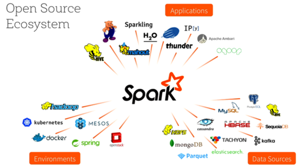
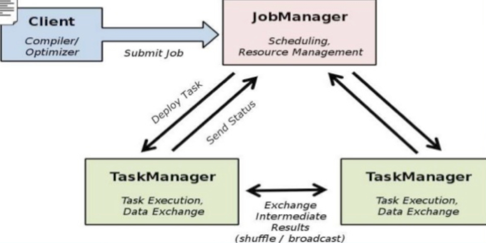
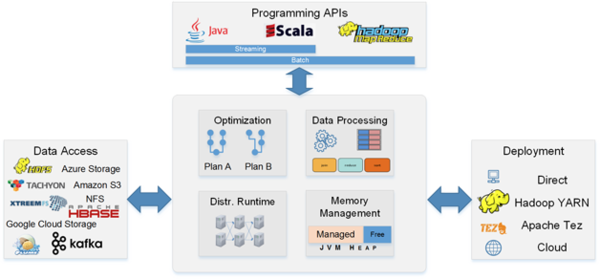
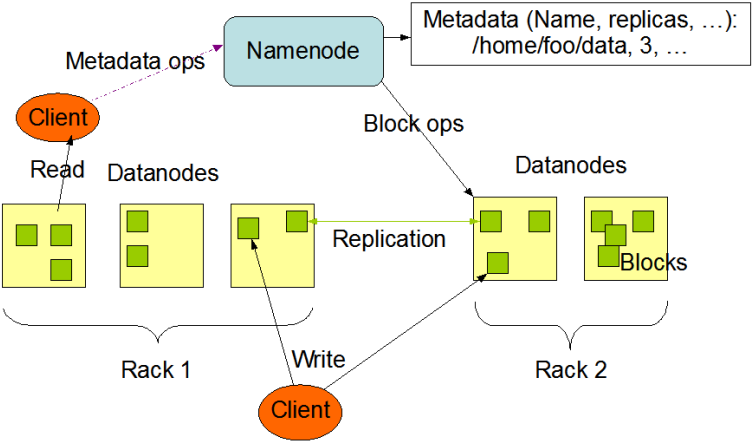

Concept for hadoop
==================

###Zookeeper
---------------
ZooKeeper是一个分布式的,开放源码的分布式应用程序协调服务,是Google的Chubby一个开源的实现,是Hadoop和Hbase的重要组件.它是一个为分布式应用提供一致性服务的软件,提供的功能包括:配置维护,域名服务,分布式同步,组服务等.
ZooKeeper的目标就是封装好复杂易出错的关键服务,将简单易用的接口和性能高效,功能稳定的系统提供给用户.
ZooKeeper包含一个简单的原语集,[1]  提供Java和C的接口.
ZooKeeper代码版本中,提供了分布式独享锁,选举,队列的接口,代码在zookeeper-3.4.3\src\recipes.其中分布锁和队列有Java和C两个版本,选举只有Java版本

ZooKeeper是以Fast Paxos算法为基础的,Paxos 算法存在活锁的问题,即当有多个proposer交错提交时,有可能互相排斥导致没有一个proposer能提交成功,而Fast Paxos作了一些优化,通过选举产生一个leader,只有leader才能提交proposer,具体算法可见Fast Paxos.因此,要想弄懂ZooKeeper首先得对Fast Paxos有所了解.[3] 
ZooKeeper的基本运转流程:
1,选举Leader.
2,同步数据.
3,选举Leader过程中算法有很多,但要达到的选举标准是一致的.
4,Leader要具有最高的zxid.
5,集群中大多数的机器得到响应并follow选出的Leader.[3] 
 Znode维护着数据,ACL(access control list,访问控制列表),时间戳等交换版本号等数据结构,

HBase和ZooKeeper
HBase内置有ZooKeeper,也可以使用外部ZooKeeper.
让HBase使用一个已有的不被HBase托管的Zookeep集群,需要设置 conf/hbase env sh文件中的HBASE_MANAGES_ZK 属性为 false
接下来,指明Zookeeper的host和端口.可以在 hbase-site.xml中设置, 也可以在HBase的CLASSPATH下面加一个zoo.cfg配置文件. HBase 会优先加载 zoo.cfg 里面的配置,把hbase-site.xml里面的覆盖掉.
当HBase托管ZooKeeper的时候,Zookeeper集群的启动是HBase启动脚本的一部分.但你需要自己去运行.你可以这样做
${HBASE_HOME}/bin/hbase-daemons sh {start,stop} zookeeper
你可以用这条命令启动ZooKeeper而不启动HBase. HBASE_MANAGES_ZK 的值是 false, 如果你想在HBase重启的时候不重启ZooKeeper,你可以这样做

###Hbase
---------------
HBase是一个分布式的,面向列的开源数据库,源于google的一篇论文<bigtable:一个结构化数据的分布式存储系统>.HBase是Google Bigtable的开源实现,它利用Hadoop HDFS作为其文件存储系统,利用Hadoop MapReduce来处理HBase中的海量数据,利用Zookeeper作为协同服务.
HBase以表的形式存储数据.表有行和列组成.列划分为若干个列族/列簇(column family).

Master选举:HBase基于Master-Slave模式架构,可以有多个HMaster,使用ZooKeeper实现了SPOF下Master的选举
租约管理:客户端与RegionServer交互时,会生成租约,该租约对象具有有效期
表元数据管理:HBase中包括用户表及其两个特殊的表:-ROOT-表和.META.表(例如,管理-ROOT-表中location信息,一个-ROOT-表只有一个Region,它保存了RegionServer的地址信息.)
协调RegionServer节点:数据变更会通过ZooKeeper同步复制到其他节点

Row Key	column-family1	column-family2	column-family3
column1	column2	column1	column2	column3	column1
key1						
key2						
key3						
如上图所示,key1,key2,key3是三条记录的唯一的row key值,column-family1,column-family2,column-family3是三个列族,每个列族下又包括几列.比如column-family1这个列族下包括两列,名字是column1和column2,t1:abc,t2:gdxdf是由row key1和column-family1-column1唯一确定的一个单元cell.这个cell中有两个数据,abc和gdxdf.两个值的时间戳不一样,分别是t1,t2, hbase会返回最新时间的值给请求者.

(1) Row Key

与nosql数据库们一样,row key是用来检索记录的主键.访问hbase table中的行,只有三种方式:
(1.1) 通过单个row key访问
(1.2) 通过row key的range
(1.3) 全表扫描

Row key行键 (Row key)可以是任意字符串(最大长度是 64KB,实际应用中长度一般为 10-100bytes),在hbase内部,row key保存为字节数组.
存储时,数据按照Row key的字典序(byte order)排序存储.设计key时,要充分排序存储这个特性,将经常一起读取的行存储放到一起.(位置相关性)
注意:  字典序对int排序的结果是1,10,100,11,12,13,14,15,16,17,18,19,2,20,21,...,9,91,92,93,94,95,96,97,98,99.要保持整形的自然序,行键必须用0作左填充.

行的一次读写是原子操作 (不论一次读写多少列).这个设计决策能够使用户很容易的理解程序在对同一个行进行并发更新操作时的行为.

(2) 列族 column family
hbase表中的每个列,都归属与某个列族.列族是表的chema的一部分(而列不是),必须在使用表之前定义.列名都以列族作为前缀.例如courses:history , courses:math 都属于 courses 这个列族.
访问控制,磁盘和内存的使用统计都是在列族层面进行的.实际应用中,列族上的控制权限能帮助我们管理不同类型的应用:我们允许一些应用可以添加新的基本数据,一些应用可以读取基本数据并创建继承的列族,一些应用则只允许浏览数据(甚至可能因为隐私的原因不能浏览所有数据).

(3) 单元 Cell
HBase中通过row和columns确定的为一个存贮单元称为cell.由{row key, column( =<family> + <label>), version} 唯一确定的单元.cell中的数据是没有类型的,全部是字节码形式存贮.

(4) 时间戳 timestamp
每个cell都保存着同一份数据的多个版本.版本通过时间戳来索引.时间戳的类型是 64位整型.时间戳可以由hbase(在数据写入时自动 )赋值,此时时间戳是精确到毫秒的当前系统时间.时间戳也可以由客户显式赋值.如果应用程序要避免数据版本冲突,就必须自己生成具有唯一性的时间戳.每个cell中,不同版本的数据按照时间倒序排序,即最新的数据排在最前面.

为了避免数据存在过多版本造成的的管理 (包括存贮和索引)负担,hbase提供了两种数据版本回收方式.一是保存数据的最后n个版本,二是保存最近一段时间内的版本(比如最近七天).用户可以针对每个列族进行设置.

###HIVE
---------------
HIVE是基于Hadoop的一个数据仓库工具,可以将结构化的数据文件映射为一张数据库表,通过类SQL语句快速实现简单的MapReduce统计,不必开发专门的MapReduce应用,十分适合数据仓库的统计分析.

###Pig
---------------
Pig是一个基于Hadoop的大规模数据分析工具,它提供的SQL-LIKE语言叫Pig Latin,该语言的编译器会把类SQL的数据分析请求转换为一系列经过优化处理的MapReduce运算.

###Solr
---------------
Solr是一个开源的分布式搜索引擎,支持索引的分片和复制,可以根据需要来线性增加节点,扩展集群.Solr使用ZooKeeper主要实现如下功能:

配置文件的管理:每个Collection都有对应的配置文件,多个分片共享配置文件(schema.xml,solrconfig.xml)
Collection管理:一个Solr集群可以有多个逻辑上独立的Collection,每个Collection又包括多个分片和副本
集群节点管理:Solr集群中有哪些活跃的节点可以使用,每个节点上都有Collection的分片(Shard)
Leader分片选举:一个Collection的多个分片可以设置冗余的副本,一个分片的多个副本中只有一个Leader可以进提供服务,如果某个存储Leader分片的节点宕机,Solr基于ZooKeeper来重新选出一个Leader分片,持续提供服务

###Lily
---------------
Lily是一个分布式数据管理平台,它基于Hadoop,HBase,Solr,ZooKeeper实现.使用ZooKeeper来注册Lily Node,从而管理集群节点的状态信息.

###BigDATA engine
---------------
首先第一代的计算引擎,无疑就是 Hadoop 承载的 MapReduce.这里大家应该都不会对 MapReduce 陌生,它将计算分为两个阶段,分别为 Map 和 Reduce.对于上层应用来说,就不得不想方设法去拆分算法,甚至于不得不在上层应用实现多个 Job 的串联,以完成一个完整的算法,例如迭代计算.
由于这样的弊端,催生了支持 DAG 框架的产生.因此,支持 DAG 的框架被划分为第二代计算引擎.如 Tez 以及更上层的 Oozie.这里我们不去细究各种 DAG 实现之间的区别,不过对于当时的 Tez 和 Oozie 来说,大多还是批处理的任务.
接下来就是以 Spark 为代表的第三代的计算引擎.第三代计算引擎的特点主要是 Job 内部的 DAG 支持(不跨越 Job),以及强调的实时计算.在这里,很多人也会认为第三代计算引擎也能够很好的运行批处理的 Job.
随着第三代计算引擎的出现,促进了上层应用快速发展,例如各种迭代计算的性能以及对流计算和 SQL 等的支持.Flink 的诞生就被归在了第四代.这应该主要表现在 Flink 对流计算的支持,以及更一步的实时性上面.当然 Flink 也可以支持 Batch 的任务,以及 DAG 的运算.

###Storm
---------------
Storm流式计算框架使用ZooKeeper来协调整个计算集群,Storm计算集群存在Nimbus和Supervisor两类节点.Nimbus负责分配任务(Topology),将任务信息写入ZooKeeper存储,然后Supervisor从ZooKeeper中读取任务信息.另外,Nimbus也监控集群中的计算任务节点,Supervisor也会发送心跳信息(包括状态信息)到ZooKeeper中,使得Nimbus可以实现状态的监控,任何计算节点出现故障,只要重新启动之后,继续从ZooKeeper中获取数据即可继续执行计算任务.

###Consul
---------------
Consul是HashiCorp公司推出的开源工具,用于实现分布式系统的服务发现与配置.与其他分布式服务注册与发现的方案,比如 Airbnb的SmartStack等相比,Consul的方案更"一站式",内置了服务注册与发现框 架,分布一致性协议实现,健康检查,Key/Value存储,多数据中心方案,不再需要依赖其他工具(比如ZooKeeper等).使用起来也较 为简单.Consul用Golang实现,因此具有天然可移植性(支持Linux,windows和Mac OS X);安装包仅包含一个可执行文件,方便部署,与Docker等轻量级容器可无缝配合.

###Spark
---------------
Spark是一种快速,通用的计算集群系统,Spark提出的最主要抽象概念是弹性分布式数据集(RDD),它是一个元素集合,划分到集群的各个节点上,可以被并行操作.用户也可以让Spark保留一个RDD在内存中,使其能在并行操作中被有效的重复使用.Flink是可扩展的批处理和流式数据处理的数据处理平台,设计思想主要来源于Hadoop,MPP数据库,流式计算系统等,支持增量迭代计算.

Spark为应用提供了REST API来获取各种信息,包括jobs,stages,tasks,storage info等.
Spark Streaming增加了UI,可以方便用户查看各种状态,另外与Kafka的融合也更加深度,加强了对Kinesis的支持.
Spark SQL(DataFrame)添加ORCFile类型支持,另外还支持所有的Hive metastore.
Spark ML/MLlib的ML pipelines愈加成熟,提供了更多的算法和工具.Tungsten项目的持续优化,特别是内存管理,代码生成,垃圾回收等方面都有很多改进.SparkR发布,更友好的R语法支持.

RDD是什么?

RDD,全称为Resilient Distributed Datasets,
是一个容错的,并行的数据结构,可以让用户显式地将数据存储到磁盘和内存中,并能控制数据的分区.同时,RDD还提供了一组丰富的操作来操作这些数据.在这些操作中,诸如map,flatMap,filter等转换操作实现了monad模式,很好地契合了Scala的集合操作.除此之外,RDD还提供了诸如join,groupBy,reduceByKey等更为方便的操作(注意,reduceByKey是action,而非transformation),以支持常见的数据运算.

通常来讲,针对数据处理有几种常见模型,包括:Iterative Algorithms,Relational Queries,MapReduce,Stream Processing.例如Hadoop MapReduce采用了MapReduces模型,Storm则采用了Stream Processing模型.RDD混合了这四种模型,使得Spark可以应用于各种大数据处理场景.

RDD作为数据结构,本质上是一个只读的分区记录集合.一个RDD可以包含多个分区,每个分区就是一个dataset片段.RDD可以相互依赖.如果RDD的每个分区最多只能被一个Child RDD的一个分区使用,则称之为narrow dependency;若多个Child RDD分区都可以依赖,则称之为wide dependency.不同的操作依据其特性,可能会产生不同的依赖.例如map操作会产生narrow dependency,而join操作则产生wide dependency.
RDD本质上是一个内存数据集,在访问RDD时,指针只会指向与操作相关的部分.例如存在一个面向列的数据结构,其中一个实现为Int的数组,另一个实现为Float的数组.如果只需要访问Int字段,RDD的指针可以只访问Int数组,避免了对整个数据结构的扫描.

RDD将操作分为两类:transformation与action.无论执行了多少次transformation操作,RDD都不会真正执行运算,只有当action操作被执行时,运算才会触发.而在RDD的内部实现机制中,底层接口则是基于迭代器的,从而使得数据访问变得更高效,也避免了大量中间结果对内存的消耗.

在实现时,RDD针对transformation操作,都提供了对应的继承自RDD的类型,例如map操作会返回MappedRDD,而flatMap则返回FlatMappedRDD.当我们执行map或flatMap操作时,不过是将当前RDD对象传递给对应的RDD对象而已.
DD对容错的支持

支持容错通常采用两种方式:数据复制或日志记录.对于以数据为中心的系统而言,这两种方式都非常昂贵,因为它需要跨集群网络拷贝大量数据,毕竟带宽的数据远远低于内存.

RDD天生是支持容错的.首先,它自身是一个不变的(immutable)数据集,其次,它能够记住构建它的操作图(Graph of Operation),因此当执行任务的Worker失败时,完全可以通过操作图获得之前执行的操作,进行重新计算.由于无需采用replication方式支持容错,很好地降低了跨网络的数据传输成本.

不过,在某些场景下,Spark也需要利用记录日志的方式来支持容错.例如,在Spark Streaming中,针对数据进行update操作,或者调用Streaming提供的window操作时,就需要恢复执行过程的中间状态.此时,需要通过Spark提供的checkpoint机制,以支持操作能够从checkpoint得到恢复.

针对RDD的wide dependency,最有效的容错方式同样还是采用checkpoint机制.不过,似乎Spark的最新版本仍然没有引入auto checkpointing机制.

总结

RDD是Spark的核心,也是整个Spark的架构基础.它的特性可以总结如下:

它是不变的数据结构存储
它是支持跨集群的分布式数据结构
可以根据数据记录的key对结构进行分区
提供了粗粒度的操作,且这些操作都支持分区
它将数据存储在内存中,从而提供了低延迟性

###Flink
---------------
Flink 是一个针对流数据和批数据的分布式处理引擎.它主要是由 Java 代码实现.目前主要还是依靠开源社区的贡献而发展.对 Flink 而言,其所要处理的主要场景就是流数据,批数据只是流数据的一个极限特例而已.再换句话说,Flink 会把所有任务当成流来处理,这也是其最大的特点.Flink 可以支持本地的快速迭代,以及一些环形的迭代任务.并且 Flink 可以定制化内存管理.在这点,如果要对比 Flink 和 Spark 的话,Flink 并没有将内存完全交给应用层.这也是为什么 Spark 相对于 Flink,更容易出现 OOM 的原因(out of memory).就框架本身与应用场景来说,Flink 更相似与 Storm.

如图所示,我们可以了解到 Flink 几个最基础的概念,Client,JobManager 和 TaskManager.Client 用来提交任务给 JobManager,JobManager 分发任务给 TaskManager 去执行,然后 TaskManager 会心跳的汇报任务状态.看到这里,有的人应该已经有种回到 Hadoop 一代的错觉.确实,从架构图去看,JobManager 很像当年的 JobTracker,TaskManager 也很像当年的 TaskTracker.然而有一个最重要的区别就是 TaskManager 之间是是流(Stream).其次,Hadoop 一代中,只有 Map 和 Reduce 之间的 Shuffle,而对 Flink 而言,可能是很多级,并且在 TaskManager 内部和 TaskManager 之间都会有数据传递,而不像 Hadoop,是固定的 Map 到 Reduce.

###YARN
---------------
为了能够对集群中的资源进行统一管理和调度,Hadoop 2.0引入了数据操作系统YARN.YARN的引入,大大提高了集群的资源利用率,并降低了集群管理成本.首先,YARN允许多个应用程序运行在一个集群中,并将资源按需分配给它们,这大大提高了资源利用率,其次,YARN允许各类短作业和长服务混合部署在一个集群中,并提供了容错,资源隔离及负载均衡等方面的支持,这大大简化了作业和服务的部署和管理成本.
YARN总体上采用master/slave架构,如图1所示,其中,master被称为ResourceManager,slave被称为NodeManager,ResourceManager负责对各个NodeManager上的资源进行统一管理和调度.当用户提交一个应用程序时,需要提供一个用以跟踪和管理这个程序的ApplicationMaster,它负责向ResourceManager申请资源,并要求NodeManger启动可以占用一定资源的Container.由于不同的ApplicationMaster被分布到不同的节点上,并通过一定的隔离机制进行了资源隔离,因此它们之间不会相互影响.
YARN中的资源管理和调度功能由资源调度器负责,它是Hadoop YARN中最核心的组件之一,是ResourceManager中的一个插拔式服务组件 .YARN通过层级化队列的方式组织和划分资源,并提供了多种多租户资源调度器,这种调度器允许管理员按照应用需求对用户或者应用程序分组,并为不同的分组分配不同的资源量,同时通过添加各种约束防止单个用户或者应用程序独占资源,进而能够满足各种QoS需求,典型代表是Yahoo!的Capacity Scheduler和Facebook的Fair Scheduler.
YARN作为一个通用数据操作系统,既可以运行像MapReduce,Spark这样的短作业,也可以部署像Web Server,MySQL Server这种长服务,真正实现一个集群多用途,这样的集群,我们通常称为轻量级弹性计算平台,说它轻量级,是因为YARN采用了cgroups轻量级隔离方案,说它弹性,是因为YARN能根据各种计算框架或者应用的负载或者需求调整它们各自占用的资源,实现集群资源共享,资源弹性收缩.

###Mesos
---------------
Mesos是一个开源的资源管理系统,可以对集群中的资源做弹性管理,抽象物理机的CPU,内存,存储和计算资源,再由框架自身的调度器决定资源的使用者.
Mesos是Master／Slave结构,由Mesos-master,Mesos-slave,Framework和executor四个组件构成.
目前twitter, apple等公司在大量使用mesos管理集群资源,大家记得apple的siri吗,它的后端便是采用的mesos进行资源管理(自行在网上查找文章:"新一代Siri后端将采用开放源代码平台Mesos").国内也有零零散散的公司在使用mesos,比如豆瓣. Mesos是高仿google内部的资源管理系统borg(论文已经发表)实现的,随着近期它对docker容器支持的越来越好,将备受关注.(注:Mesosphere,一家试图围绕 Apache Mesos 项目开展商业活动的公司,不久前从 Andreessen Horowitz 那里获得了 1000 万美元投资.他做的事情就是用开源方案实现一个borg,选用的技术栈是:mesos+docker).

Hadoop YARN要比Mesos更主流,前景更广阔.YARN在实现资源管理的系统前提下,能够跟hadoop生态系统完美结合,在YARN的东家hortonworks看来,YARN定位为大数据中的数据操作系统,能够更好地为上层各类应用程序(MapReduce/Spark)提供资源管理和调度功能.另外,非常重要的一点,YARN的社区力量要比Mesos强大的多,它的参与人员众多,周边系统的建设非常完善(包括最新诞生的apache二级项目Twill,Apache Twill ,cloudera的Kitten,均是方便大家使用YARN而诞生的项目).
YARN是从MapReduce中演化而来的,因而在大数据处理中扮演重要角色,但这也使得它受限:它现在还不能看做是一个通用的资源管理系统,太多的内部实现过于狭隘,比如资源申请和分配模型,对长服务的支持等.不过,YARN自己仍把它定位在通用资源管理系统上,因而在不断改进,比如最近的版本中,增加了对长服务和docker的支持.

###Marathon
---------------
Marathon是一个全新的框架,它将Mesos变成一个更有活力的工具,进而可以在单一的集群上运行不同的应用程序.Marathon出自于一家初创公司Mesosphere,该公司由两位前Airbnb的工程师创立.

它的设计宗旨就是让用户在同一组服务器之上,更智能地运行多种应用程序和服务--Hadoop,Storm,甚至一个标准的Web应用.Marathon出自于一家初创公司 Mesosphere之手,这家公司主要就是想构建一个数据中心操作系统,不过这个系统是运行在 Mesos集群管理软件之上,这也是 Twitter基础设施的重要组成部分.该公司的联合创始人是前Airbnb的工程师Florian Leibert(也曾在Twitter工作过)和Tobias Knaup. 

Marathon只不过占据了Mesosphere的一小部分,但是Leibert表示它很重要且有着非常大的吸引力.就目前而言,云计算和大数据的发展趋势已经从巩固阶段跳转到问题的解决阶段,未来可能需要多个分布式系统去处理那些特定的任务. 

###Kafka
---------------
kafka作为时下最流行的开源消息系统,被广泛地应用在数据缓冲,异步通信,汇集日志,系统解耦等方面.相比较于RocketMQ等其他常见消息系统,Kafka在保障了大部分功能特性的同时,还提供了超一流的读写性能.
Kafka是Linkedin于2010年12月份开源的消息系统,它主要用于处理活跃的流式数据.活跃的流式数据在web网站应用中非常常见,这些数据包括网站的pv,用户访问了什么内容,搜索了什么内容等. 这些数据通常以日志的形式记录下来,然后每隔一段时间进行一次统计处理.
传统的日志分析系统提供了一种离线处理日志信息的可扩展方案,但若要进行实时处理,通常会有较大延迟.而现有的消(队列)系统能够很好的处理实时或者近似实时的应用,但未处理的数据通常不会写到磁盘上,这对于Hadoop之类(一小时或者一天只处理一部分数据)的离线应用而言,可能存在问题.Kafka正是为了解决以上问题而设计的,它能够很好地离线和在线应用.
2,  设计目标
(1)数据在磁盘上存取代价为O(1).一般数据在磁盘上是使用BTree存储的,存取代价为O(lgn).
(2)高吞吐率.即使在普通的节点上每秒钟也能处理成百上千的message.
(3)显式分布式,即所有的producer,broker和consumer都会有多个,均为分布式的.
(4)支持数据并行加载到Hadoop中.

###thrift
---------------
Thrift是一个跨语言的服务部署框架,最初由Facebook于2007年开发,2008年进入Apache开源项目.Thrift通过一个中间语言(IDL, 接口定义语言)来定义RPC的接口和数据类型,然后通过一个编译器生成不同语言的代码(目前支持C++,Java, Python, PHP, Ruby, Erlang, Perl, Haskell, C#, Cocoa, Smalltalk和OCaml),并由生成的代码负责RPC协议层和传输层的实现.

###Zepellin
---------------
Zepellin是一个集成IPythoon notebook风格的Spark应用.Zepellin可以基于Spark和Scala,允许用户很简单直接的在他们的博客或者网站发布代码执行的结果.
Zepellin也支持其它语言插件,包括Scala和Spark,Python和Spark,SparkSQL,HIve,Markdown和Shell.

###Alluxio
---------------
Alluxio是一个分布式内存文件系统,它在减轻Spark内存压力的同时,也赋予Spark内存快速读写海量数据的能力.Alluxio以前叫做Tachyon,即钨丝.Spark jobs可以不做任何改变即可运行在Alluxio上,并能得到极大的性能优化.Alluxio宣称:"百度使用Alluxio可以提高30倍多数据处理能力".

###Sqoop
---------------
Sqoop:是SQL-to-Hadoop的缩写,主要用于传统数据库和Hadoop之前传输数据. 数据的导入和导出本质上是Mapreduce程序,充分利用了MR的并行化和容错性 是一个用来将Hadoop和关系型数据库中的数据相互转移的工具,可以将一个关系型数据库(MySQL ,Oracle ,Postgres等)中的数据导进到Hadoop的HDFS中,也可以将HDFS的数据导进到关系型数据库中.
Sqoop用于将关系形数据库(如mysql)或者其它结构化的数据导入到hadoop的生态系统中(HDFS,Hive , HBase),反过来也可以将hadoop的数据导出为对应的结构形式.

###Mahout
---------------
Mahout:是基于Hadoop的机器学习和数据挖掘的一个分布式框架.Mahout用MapReduce实现了部分数据挖掘算法,解决了并行挖掘的问题.

###Cassandra
---------------
Cassandra:是一套开源分布式NoSQL数据库系统.它最初由Facebook开发,用于储存简单格式数据,集Google BigTable的数据模型与Amazon Dynamo的完全分布式的架构于一身

###Avro
---------------
Avro: 是一个数据序列化系统,设计用于支持数据密集型,大批量数据交换的应用.Avro是新的数据序列化格式与传输工具,将逐步取代Hadoop原有的IPC机制

###Ambari
---------------
Ambari: 是一种基于Web的工具,支持Hadoop集群的供应,管理和监控.

###Chukwa
---------------
Chukwa: 是一个开源的用于监控大型分布式系统的数据收集系统,它可以将各种各样类型的数据收集成适合 Hadoop 处理的文件保存在 HDFS 中供 Hadoop 进行各种 MapReduce 操作.

###Hama
---------------
Hama: 是一个基于HDFS的BSP(Bulk Synchronous Parallel)并行计算框架, Hama可用于包括图,矩阵和网络算法在内的大规模,大数据计算.

###Flume
---------------
Flume: 是一个分布的,可靠的,高可用的海量日志聚合的系统,可用于日志数据收集,日志数据处理,日志数据传输.
Flume是一个类似facebook的scribe的分布式,高可靠,高可用,高效的数据收集器,一般用于聚合众多服务器上面的大量日志到某一个数据中心.

###Oozie
---------------
Oozie: 是一个工作流引擎服务器, 用于管理和协调运行在Hadoop平台上(HDFS,Pig和MapReduce)的任务.
Oozie是可扩展可伸缩的工作流协调管理器.Oozie协调的作业属于一次性的非循环作业,例如MapReduce, Streaming, Pipes, Pig, Hive, Sqoop等等都是.Oozie将要调度的作业作为一个单一的作业来管理.Oozie的
调度基于时间跟数据可用性.具有数据感知功能,可以协调作业之间的依赖关系.

###Bigtop
---------------
Bigtop: 是一个对Hadoop及其周边生态进行打包,分发和测试的工具.

###Cloudera Hue
---------------
Cloudera Hue: 是一个基于WEB的监控和管理系统,实现对HDFS,MapReduce/YARN, HBase, Hive, Pig的web化操作和管理.
Hue(Hadoop User Experience)是cdh专门的一套web管理器,它包括3个部分hue ui,hue server,hue db.hue提供所有的cdh组件的shell界面的接口.你可以在hue编写mr,查看修改hdfs的文件,管理hive的元数据,运行Sqoop,编写Oozie工作流等大量工作.

###HDFS
---------------
HDFS集群以Master-Slave模式运行,主要有两类节点:一个Namenode(即Master)和多个Datanode(即Slave).

Namenode 管理者文件系统的Namespace.它维护着文件系统树(filesystem tree)以及文件树中所有的文件和文件夹的元数据(metadata)
Datanode是文件系统的工作节点,他们根据客户端或者是namenode的调度存储和检索数据,并且定期向namenode发送他们所存储的块(block)的列表.

###JCE
---------------
JCE = Java Cryptography Extension.可以理解成包含一堆加密/解密算法的库.由于美国出口的限制,这个库不能随JDK一起分发.必须到oracle的网站上单独下载.下载后解压并替换$JAVA_HOME/jre/lib/security中的同名文件.

###Jenkins
---------------
Jenkins是基于Java开发的一种持续集成工具,用于监控持续重复的工作,功能包括:
1,持续的软件版本发布/测试项目.
2,监控外部调用执行的工作.

###HttpFS
---------------
HttpFS提供REST HTTP API来读写hdfs.

###Snappy
---------------
Snappy是压缩跟解压缩工具,它的应用包括将mr的最终输出结果压缩起来,Sqoop导入数据的时候也可以使用这个压缩引擎.

###Swagger
---------------
Swagger 是一个规范和完整的框架,用于生成,描述,调用和可视化 RESTful 风格的 Web 服务.总体目标是使客户端和文件系统作为服务器以同样的速度来更新.文件的方法,参数和模型紧密集成到服务器端的代码,允许API来始终保持同步.Swagger 让部署管理和使用功能强大的API从未如此简单.
有时对一些API说明的理解比较模糊,总想着能直接验证一下自己的理解就好了,而不是需要去项目写测试代码来验证自己的想法.即API文档应具备直接执行能力. Swagger就是这样的一个利器

###Finagle
---------------
Finagle 是一个容错的,与协议无关的RPC系统.Finagle 使用 sbt 进行构建.Finagle 来自 Twitter, Finagle是Twitter基于Netty开发的支持容错的,协议无关的RPC框架.
使用 Finagle 可以快速实现异步的远程方法调用 RPC 客户端和服务器端,本身足够灵活支持多种 RPC 变种,包括请求响应式,流和管道模式,如 HTTP 管道和 Redis 管道,也可轻松的有状态的 RPC 一起运行,例如那些需要认证的 RPC 服务.

###Dubbo
---------------

###Sinatra
---------------
Sinatra是一个基于Ruby语言,以最小精力为代价快速创建web应用为目的的DSL (link is external)( 领域专属语言)

###Finatra
---------------
Finatra是一个scala web框架.灵感来自scalatra,由Twitter-Server驱动.

###OpenTSDB
---------------
OpenTSDB是基于HBase存储时间序列数据的一个开源数据库,确切地说,它只是一个HBase的应用而已,其对于时间序列数据的处理可以供其他系统参考和借鉴

###ant
---------------
Ant是一个Apache基金会下的跨平台的构件工具,它可以实现项目的自动构建和部署等功能
Ant运行时需要一个XML文件(构建文件). Ant通过调用target树,就可以执行各种task.每个task实现了特定接口对象.由于Ant构建文件时XML格式的文件,所以和容易维护和书写,而且结构很清晰. Ant可以集成到开发环境中.由于Ant的跨平台性和操作简单的特点,它很容易集成到一些开发环境中去.

###maven
---------------
Maven是基于项目对象模型(POM),可以通过一小段描述信息来管理项目的构建,报告和文档的软件项目管理工具.
Maven 除了以程序构建能力为特色之外,还提供高级项目管理工具.由于 Maven 的缺省构建规则有较高的可重用性,所以常常用两三行 Maven 构建脚本就可以构建简单的项目.由于 Maven 的面向项目的方法,许多 Apache Jakarta 项目发文时使用 Maven,而且公司项目采用 Maven 的比例在持续增长.
Ant 为 Java 技术开发项目提供跨平台构建任务.Maven 本身描述项目的高级方面,它从 Ant 借用了绝大多数构建任务.因此,由于 Maven 和 Ant代表两个差异很大的工具

###Kubernetes
---------------
Kubernetes是Google开源的容器集群管理系统.它构建Ddocker技术之上,为容器化的应用提供资源调度,部署运行,服务发现,扩容缩容等整一套功能,本质上可看作是基于容器技术的mini-PaaS平台

###Slider
---------------
Apache Slider 是一个 YARN 应用,用于发布已有的分布式应用到 YARN 上,并对这些应用进行监控以及根据需要调整规模,该项目是YARN之外的孵化项目,目的是将用户的已有服务或者应用直接部署到YANR上.
随着YARN的完善,目前已经能够直接部署服务,比如HBase,Storm等,而Apache Slider直接源自于Hoya,一个尝试将HBase部署到YARN上的项目.将HBase运行在YARN上将带来众多好处,包括:
(1)在一个物理集群中可同时部署多个HBase集群实例
(2)为HBase集群提供资源隔离(这一点HBase本身做不到)
(3)将多个版本的HBase集群部署到一个物理集群中

###Knox
---------------
Apache Knox Gateway 项目的目的是为了简化和标准化发布和实现安全的 Hadoop 集群,通过集中式的 REST APIs 访问服务.

###Falcon
---------------
Apache Falcon 是一个面向Hadoop的,新的数据处理和管理平台,设计用于数据移动,数据管道协调,生命周期管理和数据发现.它使终端用户可以快速地将他们的数据及其相关的处理和管理任务"上载(onboard)"到Hadoop集群.
Apache Falcon解决了大数据领域中一个非常重要和关键的问题.升级为顶级项目是该项目的一个重大进展.Apache Falcon有一个完善的路线图,可以减少应用程序开发和管理人员编写和管理复杂数据管理和处理应用程序的痛苦.

###Phoenix
---------------
Apache Phoenix 是 HBase 的 SQL 驱动.Phoenix 使得 HBase 支持通过 JDBC 的方式进行访问,并将你的 SQL 查询转成 HBase 的扫描和相应的动作.
Phoenix完全使用Java编写,代码位于GitHub上,并且提供了一个客户端可嵌入的JDBC驱动.
根据项目所述,Phoenix被Salesforce.com内部使用,对于简单的低延迟查询,其量级为毫秒;对于百万级别的行数来说,其量级为秒.Phoenix并不是像HBase那样用于map-reduce job的,而是通过标准化的语言来访问HBase数据的.
根据项目创建者所述,对于10M到100M的行的简单查询来说,Phoenix要胜过Hive.对于使用了HBase API,协同处理器及自定义过滤器的Impala与OpenTSDB来说,进行相似的查询Phoenix的速度也会更快一些.
Phoenix查询引擎会将SQL查询转换为一个或多个HBase scan,并编排执行以生成标准的JDBC结果集.直接使用HBase API,协同处理器与自定义过滤器,对于简单查询来说,其性能量级是毫秒,对于百万级别的行数来说,其性能量级是秒.
嵌入式的JDBC驱动,实现了大部分的java.sql接口,包括元数据API
可以通过多部行键或是键/值单元对列进行建模
完善的查询支持,可以使用多个谓词以及优化的扫描键
DDL支持:通过CREATE TABLE,DROP TABLE及ALTER TABLE来添加/删除列
版本化的模式仓库:当写入数据时,快照查询会使用恰当的模式
DML支持:用于逐行插入的UPSERT VALUES,用于相同或不同表之间大量数据传输的UPSERT SELECT,用于删除行的DELETE
通过客户端的批处理实现的有限的事务支持
单表--还没有连接,同时二级索引也在开发当中
紧跟ANSI SQL标准

### Metrics
---------------
是hadoop生态圈的监控指标框架

### TPS 
---------------
每秒事务处理量(TransactionPerSecond) 每秒钟系统能够处理的交易或事务的数量.它是衡量系统处理能力的重要指标.TPS是LoadRunner中重要的性能参数指标.

### QPS
---------------
每秒查询率QPS(Query Per Second)是对一个特定的查询服务器在规定时间内所处理流量多少的衡量标准.

###Grafana
---------------
Grafana 是 Graphite 和 InfluxDB 仪表盘和图形编辑器.Grafana 是开源的,功能齐全的度量仪表盘和图形编辑器,支持 Graphite,InfluxDB 和 OpenTSDB.
Grafana 主要特性:灵活丰富的图形化选项;可以混合多种风格;支持白天和夜间模式;多个数据源;Graphite 和 InfluxDB 查询编辑器等等.

### SOA
---------------
SOA是英文Service-Oriented Architecture 三个首字母单词的缩写,中文译为:面向服务架构(SOA),SOA架构与B/S ,C/S架构是目前最流行三种Web服务的基础架构. 

###
---------------

